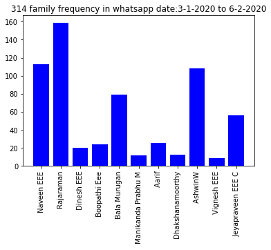

#             FINDING THE ACTIVE PERSONS IN  WHATSAPP GROUP

## IMPORTING THE DATA

 Read the data from the  whatsapp group  as a text file format


```python
with open (r'WhatsApp Chat with ❣314 Family❣.txt', 'rb') as myfile:  # Open file lorem.txt for reading text
    li=[]
    for myline in myfile:
        myline=str(myline)
        k=myline.split('-')
        li.append(k)
    for i in range(5):
        print(li[i])

```

    ["b'03/01/2020, 8:32 pm ", " Jeyapraveen EEE C: <Media omitted>\\n'"]
    ["b'03/01/2020, 8:32 pm ", " Jeyapraveen EEE C: Study yellow marked questions\\n'"]
    ["b'03/01/2020, 8:32 pm ", " Jeyapraveen EEE C: <Media omitted>\\n'"]
    ["b'03/01/2020, 8:32 pm ", " Rajaraman: <Media omitted>\\n'"]
    ["b'03/01/2020, 8:32 pm ", " Rajaraman: <Media omitted>\\n'"]
    

filtering the names of the members in the group who had message


```python
li2=[]
for i in li:
    k=i[1].split(':')
    li2.append(k[0])
print(set(li2))

```

    {" Rajaraman added AshwinW\\n'", ' Naveen EEE', ' Rajaraman', ' Dinesh EEE', ' Boopathi Eee', ' Bala Murugan', ' Manikanda Prabhu M', " AshwinW left\\n'", ' Jeyapraveen EEE C changed this group\'s icon\\n"', ' Aarif', "\\n'", ' Dhakshanamoorthy', ' AshwinW', ' Vignesh EEE', 'C', ' Jeyapraveen EEE C'}
    

selecting the neccessary value from the text file and finding the frequency of the messages of each person


```python
l={}
for i in set(li2):
    l[i]=li2.count(i)
    if l[i]<4:
       del l[i]
ll=set(l)
print(ll)
print()
print("    frequency of the person in the group   ")
for i,j in l.items():
    print(i,"----",j)

            
```

    {' Naveen EEE', ' Rajaraman', ' Dinesh EEE', ' Boopathi Eee', ' Bala Murugan', ' Manikanda Prabhu M', ' Aarif', ' Dhakshanamoorthy', ' AshwinW', ' Vignesh EEE', ' Jeyapraveen EEE C'}
    
        frequency of the person in the group   
     Naveen EEE ---- 113
     Rajaraman ---- 159
     Dinesh EEE ---- 20
     Boopathi Eee ---- 24
     Bala Murugan ---- 79
     Manikanda Prabhu M ---- 11
     Aarif ---- 25
     Dhakshanamoorthy ---- 12
     AshwinW ---- 108
     Vignesh EEE ---- 8
     Jeyapraveen EEE C ---- 56
    

## VISUALISATION:

 Creating the plot to visulaize the most active person in the group 


```python
import numpy as np
import matplotlib.pyplot as plt
pos = np.arange(len(l.keys()))
plt.xticks(rotation=90)
plt.title("314 family frequency in whatsapp date:3-1-2020 to 6-2-2020")
plt.bar(l.keys(), l.values(),color='b')
plt.show()
```




